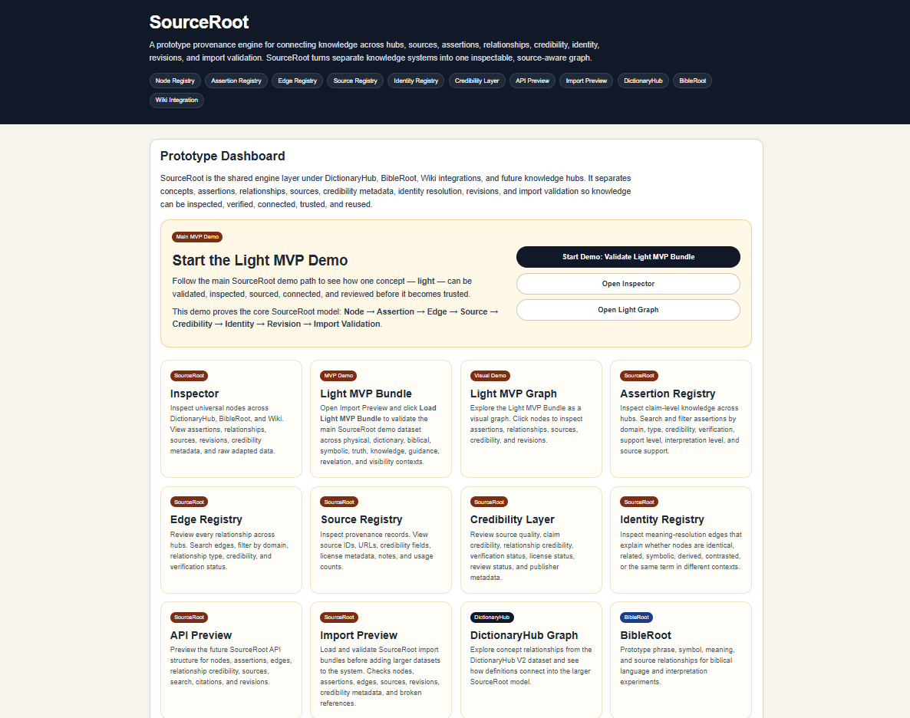
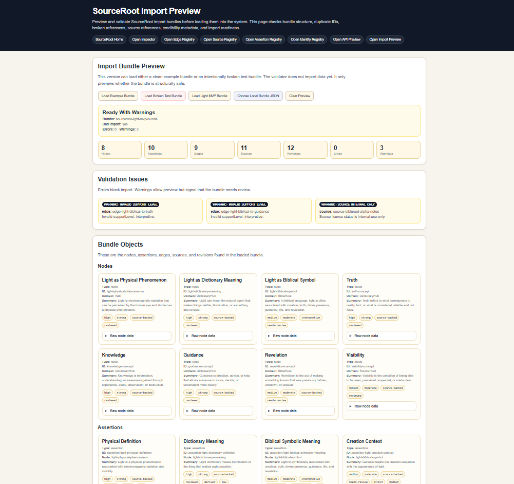
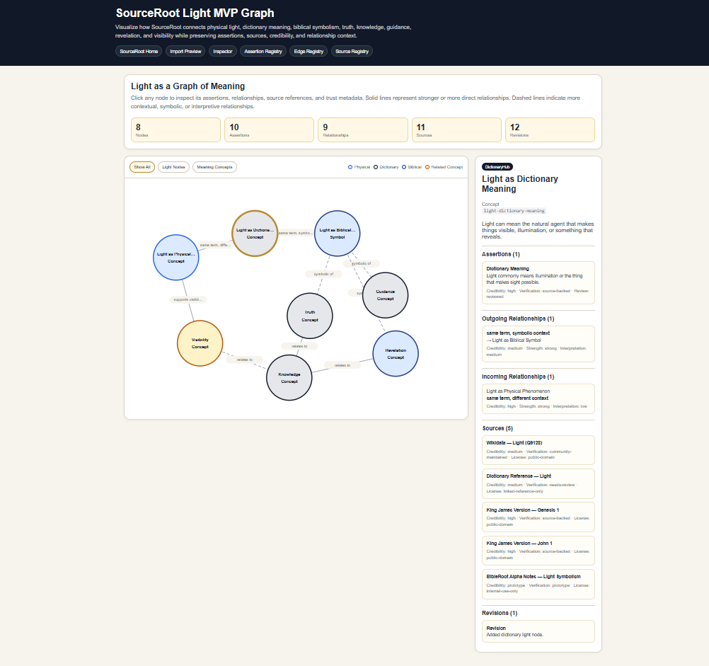
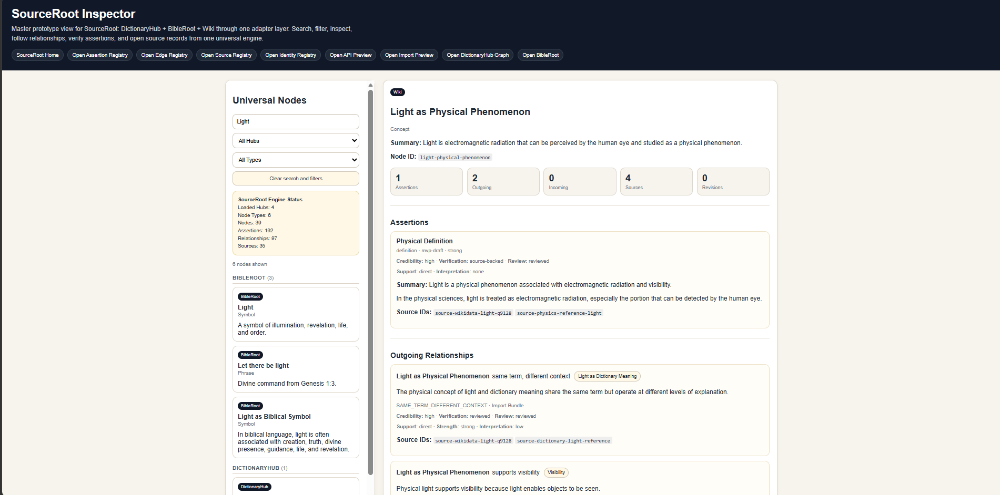
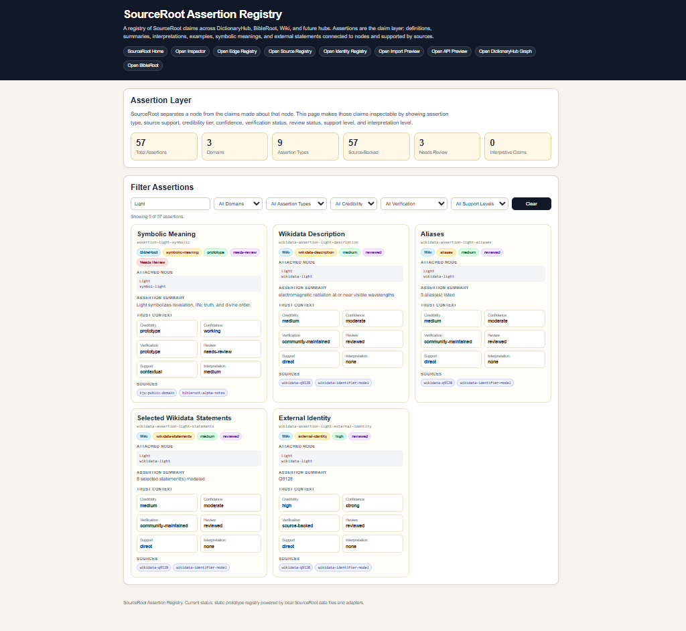
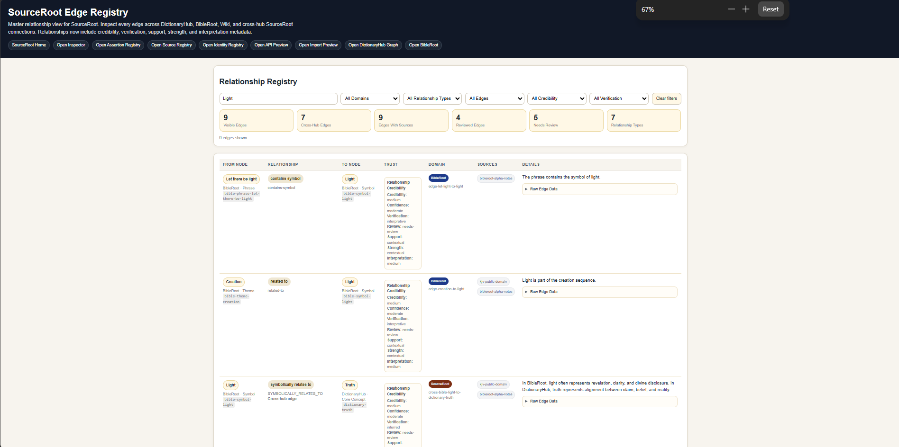
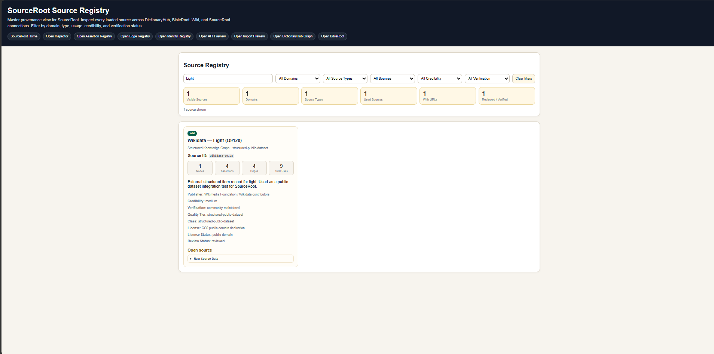

# SourceRoot

SourceRoot is a prototype knowledge provenance engine.

It is designed to organize knowledge into inspectable parts:

```text
Node → Assertion → Edge → Source → Credibility → Identity → Revision → Import Validation
```

The goal is simple:

```text
Make knowledge inspectable before it becomes trusted.
```

SourceRoot is not just a dictionary, Bible tool, wiki viewer, or graph demo.

It is the layer underneath knowledge applications that asks:

```text
What is being claimed?
Where did it come from?
How is it connected?
How trustworthy is it?
Has it been reviewed?
Can it be imported safely?
Can it be cited responsibly?
```

The current MVP includes a working Light demo with validation, an MVP Walkthrough, an Import Bundle Registry, inspection, a visual graph, registries, source metadata, credibility metadata, screenshots, API examples, and documentation.

---

## Current MVP

The current MVP centers on the **Light MVP Bundle**.

The demo models the concept of:

```text
Light
```

across multiple contexts:

```text
physical light
dictionary meaning
biblical symbolism
truth
knowledge
guidance
revelation
visibility
```

The point is not only to define the word “light.”

The point is to prove that SourceRoot can separate:

```text
the concept
the claims
the relationships
the sources
the credibility metadata
the revision history
the import readiness status
```

---

## Screenshots

These screenshots show the current SourceRoot MVP demo flow.

### SourceRoot Dashboard



The dashboard introduces SourceRoot as the provenance engine and gives users a direct starting path for the Light MVP demo.

---

### Import Preview — Light MVP Bundle



The Import Preview validates the Light MVP Bundle before it enters the system.

Expected result:

```text
Ready With Warnings
Can Import: Yes
Errors: 0
Warnings: 3
```

This shows that SourceRoot can separate structurally safe data from fully reviewed public-release-ready data.

---

### Light MVP Visual Graph



The Light MVP Graph visualizes how one concept connects across physical, dictionary, biblical, symbolic, truth, knowledge, guidance, revelation, and visibility contexts.

Users can click each node to inspect:

```text
assertions
relationships
sources
credibility metadata
revision context
```

---

### SourceRoot Inspector



The Inspector shows the imported Light MVP Bundle as part of the universal SourceRoot view.

It allows users to inspect:

```text
nodes
assertions
outgoing relationships
incoming relationships
sources
revisions
raw adapted data
```

---

### Assertion Registry



The Assertion Registry shows claim-level knowledge across the system.

This is where SourceRoot separates a concept from the individual claims made about that concept.

---

### Edge Registry



The Edge Registry shows relationship-level knowledge.

This is where SourceRoot distinguishes direct, derived, contextual, symbolic, and interpretive relationships.

---

### Source Registry



The Source Registry shows provenance records, source quality, usage, credibility metadata, license status, and review status.

---

## Why This Matters

Most knowledge systems flatten information into a page, paragraph, entry, article, or generated answer.

SourceRoot breaks knowledge into structured layers.

A node is not the full truth.

A node is a container.

Assertions are individual claims.

Edges are relationships between nodes.

Sources support claims and relationships.

Credibility metadata explains how much trust each layer currently deserves.

Revisions show how the knowledge changed.

Import validation checks whether a bundle is structurally safe before it enters the system.

This allows SourceRoot to show uncertainty instead of hiding it.

---

## Core Model

### Node

A concept, term, entity, phrase, object, or idea.

### Assertion

A specific claim about a node.

### Edge

A relationship between two nodes.

### Source

A record of where a claim or relationship came from.

### Credibility

Metadata describing confidence, verification, review status, support level, and interpretation level.

### Identity

Resolution between similar, identical, related, symbolic, or conflicting concepts.

### Revision

A record of changes to the knowledge object.

### Import Validation

A safety check before structured knowledge is accepted into the system.

---

## Prototype Pages

Open the public landing page first:

```text
index.html
```

Open the guided walkthrough from there:

```text
sourceroot-mvp-walkthrough.html
```

Open the main SourceRoot dashboard from there:

```text
sourceroot.html
```

Main prototype pages:

```text
index.html
sourceroot-mvp-walkthrough.html
sourceroot.html
sourceroot-import-bundle-registry.html
sourceroot-import-preview.html
sourceroot-light-graph.html
sourceroot-inspector.html
sourceroot-assertion-registry.html
sourceroot-edge-registry.html
sourceroot-source-registry.html
sourceroot-identity-registry.html
sourceroot-api-preview.html
bibleroot.html
graph-v2.html
```

---

## Recommended Demo Flow

Use this flow for the MVP demo:

```text
1. Open index.html
2. Open sourceroot-mvp-walkthrough.html
3. Open sourceroot.html
4. Open the Import Bundle Registry
5. Review the Light MVP Bundle status
6. Open Import Preview
7. Click Load Light MVP Bundle
8. Confirm Ready With Warnings
9. Confirm Errors: 0
10. Open the Light MVP Graph
11. Click a Light node in the graph
12. Inspect assertions, relationships, sources, and trust metadata
13. Open the Inspector
14. Use the Light MVP Demo Path buttons
15. Inspect Dictionary Light, BibleRoot Light, Truth, and Knowledge
16. Open Assertion Registry
17. Search light
18. Open Edge Registry
19. Search light
20. Open Source Registry
21. Review source and license metadata
22. Open API Preview
23. Open the exportable API response examples
```

---

## MVP Walkthrough

Open:

```text
sourceroot-mvp-walkthrough.html
```

The MVP Walkthrough is the guided presentation page for SourceRoot.

It gives a stranger the complete demo path from start to finish:

```text
Landing Page
Dashboard
Import Bundle Registry
Import Preview
Light Graph
Inspector
Assertion Registry
Edge Registry
Source Registry
API Preview
API example JSON files
```

The walkthrough includes:

```text
step-by-step demo cards
presenter checklist
simple talk track
links to each MVP page
links to API example JSON files
```

Use this page when presenting SourceRoot to someone who has never seen the project before.

---

## Light MVP Bundle

File location:

```text
data/sourceroot-light-mvp-bundle.json
```

Expected validation result:

```text
Ready With Warnings
Can Import: Yes
Errors: 0
Warnings: 3
```

Current bundle contents:

```text
8 nodes
10 assertions
9 edges
11 sources
12 revisions
```

The warnings are expected.

They show that SourceRoot can separate:

```text
safe to preview
```

from:

```text
fully reviewed and public-release ready
```

That distinction is one of the core points of the MVP.

---

## Import Bundle Registry

Open:

```text
sourceroot-import-bundle-registry.html
```

The Import Bundle Registry is the catalog layer for SourceRoot imports.

It shows available bundles, validation status, object counts, known warnings, known errors, readiness notes, and related actions.

Current registry entries:

```text
Light MVP Bundle
Example Import Bundle
Broken Import Bundle
```

The registry connects import bundles to:

```text
Import Preview
Light Graph
Inspector
API examples
source JSON files
```

This page helps SourceRoot feel less like separate demos and more like a system that can manage multiple knowledge imports.

---

## Import Preview

Open:

```text
sourceroot-import-preview.html
```

Available actions:

```text
Load Example Bundle
Load Broken Test Bundle
Load Light MVP Bundle
Choose Local Bundle JSON
Clear Preview
```

This page proves that SourceRoot can validate structured knowledge before accepting it.

It checks for issues such as:

```text
missing required fields
duplicate IDs
broken node references
broken source references
invalid credibility values
internal-only source warnings
review warnings
```

---

## Light MVP Graph

Open:

```text
sourceroot-light-graph.html
```

The Light MVP Graph provides a visual version of the Light MVP Bundle.

It shows:

```text
nodes
relationships
directional edges
direct relationships
symbolic relationships
contextual relationships
source context
assertion context
credibility metadata
revision context
```

This page helps make the SourceRoot model understandable at a glance.

---

## Inspector

Open:

```text
sourceroot-inspector.html
```

The Inspector loads multiple knowledge sources through one universal view:

```text
DictionaryHub
BibleRoot
Wiki
Light MVP Bundle
```

The Inspector allows the user to inspect:

```text
nodes
assertions
outgoing relationships
incoming relationships
sources
revisions
raw adapted data
```

The Light MVP Demo Path includes quick buttons for:

```text
Wiki Light
Dictionary Light
BibleRoot Light
Truth
Knowledge
```

---

## Assertion Registry

Open:

```text
sourceroot-assertion-registry.html
```

The Assertion Registry shows the claim layer across the system.

It can filter assertions by:

```text
domain
assertion type
credibility
verification
support
review status
```

This matters because SourceRoot treats claims as inspectable objects.

A source can be reliable while a specific interpretation may still need review.

---

## Edge Registry

Open:

```text
sourceroot-edge-registry.html
```

The Edge Registry shows relationships between nodes.

Relationships also carry trust metadata.

This allows SourceRoot to distinguish between:

```text
direct relationships
derived relationships
contextual relationships
symbolic relationships
interpretive relationships
needs-review relationships
```

Example:

```text
physical light → visibility
```

is more direct than:

```text
biblical light → truth
```

Both relationships are useful.

They should not carry the same trust level.

---

## Source Registry

Open:

```text
sourceroot-source-registry.html
```

The Source Registry shows source metadata, including:

```text
publisher
source type
quality tier
credibility tier
verification status
license
license status
review status
last reviewed
usage
```

This is the foundation of the provenance model.

---

## Identity Registry

Open:

```text
sourceroot-identity-registry.html
```

The Identity Registry shows meaning-resolution relationships.

It helps inspect whether concepts are:

```text
identical
related
symbolic
derived
contrasted
the same term in different contexts
```

---

## API Preview

Open:

```text
sourceroot-api-preview.html
```

The API Preview shows what future SourceRoot retrieval and validation could look like.

It models endpoints and flows such as:

```text
Validate Import Bundle
Check Assertion Credibility
Check Relationship Credibility
Resolve Identity
Retrieve Sources
Preview Import
```

It also links to exportable static API response examples for the Light MVP.

Current API example files:

```text
data/api-examples/sourceRoot-light-node-response.json
data/api-examples/sourceRoot-light-validation-response.json
data/api-examples/sourceRoot-light-citation-response.json
```

---

## Data Folders

Important data files:

```text
data/sourceroot-light-mvp-bundle.json
data/sourceroot-import-bundle-example.json
data/sourceroot-import-bundle-broken-example.json
data/nodes-v2-root.json
data/sources-v2.json
data/bible-root-nodes.json
data/bible-root-edges.json
data/bible-root-assertions.json
data/bible-root-sources.json
data/wikidata-root-nodes.json
data/wikidata-root-edges.json
data/wikidata-root-sources.json
data/sourceroot-cross-hub-edges.json
data/api-examples/sourceRoot-light-node-response.json
data/api-examples/sourceRoot-light-validation-response.json
data/api-examples/sourceRoot-light-citation-response.json
```

---

## Engine Files

Core engine files:

```text
engine/sourceRootEngine.js
engine/importValidator.js
engine/adapters/dictionaryAdapter.js
engine/adapters/bibleAdapter.js
engine/adapters/wikidataAdapter.js
engine/adapters/importBundleAdapter.js
```

The engine currently supports:

```text
node combining
node search
import validation
dictionary adaptation
BibleRoot adaptation
Wiki adaptation
import bundle adaptation
Light MVP bundle adaptation
```

---

## Documentation

Important docs and walkthrough files:

```text
sourceroot-mvp-walkthrough.html
docs/sourceroot-light-mvp-bundle.md
docs/sourceroot-light-mvp-demo-script.md
docs/sourceroot-import-bundle-format.md
docs/sourceroot-import-validation-rules.md
docs/sourceroot-v3-core-model.md
docs/sourceroot-v3-assertion-model.md
docs/sourceroot-v3-architecture.md
docs/sourceroot-credibility-model.md
docs/sourceroot-assertion-credibility-model.md
docs/sourceroot-relationship-credibility-model.md
docs/sourceroot-identity-resolution-model.md
```

Screenshot folder:

```text
docs/screenshots/
```

Screenshot files expected:

```text
docs/screenshots/sourceroot-dashboard-start-demo.png
docs/screenshots/sourceroot-import-preview-light-ready.png
docs/screenshots/sourceroot-light-graph.png
docs/screenshots/sourceroot-inspector-light-node.png
docs/screenshots/sourceroot-assertion-registry-light.png
docs/screenshots/sourceroot-edge-registry-light.png
docs/screenshots/sourceroot-source-registry.png
```

---

## Local Development

This prototype is currently a static front-end project.

Recommended local setup:

```text
Open the project in VS Code
Use Live Server
Open index.html
```

Do not open the HTML files directly with `file://`.

Some pages use JavaScript modules and fetch local JSON files, so they need to run through a local server.

Example local URLs:

```text
http://127.0.0.1:5500/index.html
http://127.0.0.1:5500/sourceroot-mvp-walkthrough.html
http://127.0.0.1:5500/sourceroot.html
```

---

## Current Status

```text
Status: MVP prototype
Main demo: Light MVP Bundle
Public landing page: Working
MVP Walkthrough: Working
Import Bundle Registry: Working
Import validation: Working
Light MVP visual graph: Working
Inspector integration: Working
Assertion Registry: Working
Edge Registry: Working
Source Registry: Working
Identity Registry: Working
API Preview: Prototype
API response examples: Working
Public-release readiness: Not final
```

---

## What The MVP Proves

The current MVP proves that SourceRoot can:

```text
validate import bundles
catalog available import bundles
guide a complete MVP walkthrough
load structured knowledge
inspect nodes
inspect assertions
inspect relationships
inspect sources
track credibility metadata
track review status
track interpretation level
surface warnings
model one concept across multiple contexts
link API-style response examples
support future AI citation and provenance workflows
```

---

## What Comes Next

Possible next builds:

```text
Improve Light demo polish
Add schema documentation
Add exportable API response previews inside the UI
Add more source-backed dictionary data
Add more BibleRoot phrase data
Add more identity resolution examples
Move more adapter logic into reusable engine modules
Create a real backend API prototype
Add bundle validation history
Add a citation event registry
```

---

## Final Summary

SourceRoot makes knowledge inspectable before it becomes trusted.

The Light MVP demo shows how one concept can be modeled across different domains while preserving:

```text
meaning
claims
relationships
sources
credibility
identity
revision history
import readiness
```

The larger vision is a provenance layer for human and AI-readable knowledge.

SourceRoot is the trust layer underneath knowledge applications.